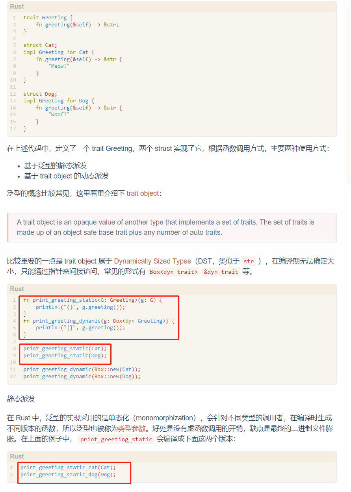

## 关于泛型

item: &impl Summary, 就是泛型, 等效于 item: T where T: Summary

前面的写法, 只是语法糖, 真实的是后面的写法

泛型就是单态化, 也就是特定类型单独实现, rust不存在所谓的泛型, 只是为每一个特定类型生成了 特定类型的函数

这里, 直接就生成了特定类型(具体类型)的函数调用, 此处的泛型, 只是起限定作用了, 只是编译器检查就行了, 保证 类型正确性, 并生成特定类型的函数

于是, 这里的泛型函数, 就属于静态分发, 类型啥的都是确定的, 实现trait实际上都直接为原始data作为参数, 生成了函数, 没有vtable

## 关于闭包

当创建一个闭包的时候, 实际上rust生成了一个匿名的struct, 它包含函数指针, 和 引用或捕获的变量, 这个匿名struct会根据闭包是否使用可变引用或不可变引用或捕获, 自动实现 FnOnce, FnMut, Fn, 并创建匿名结构体的实例

当调用的时候, 就是执行这三个中的call函数, 第一个参数分别是: self, &self, &mut self. 于是执行完成后, 对于self, 即FnOnce 这个匿名struct所有权已经回收了, 只能执行一次. 对于 &self 和 &mut self, 即 FnMut 和 Fn, 是可以继续执行的.
