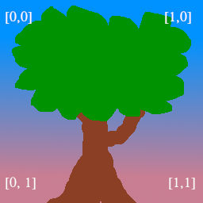

创建 buffer, 并指定 buffer 的格式, 如下: UNIFORM 格式

``` rust
let uniform_buffer = device.create_buffer_init(&wgpu::util::BufferInitDescriptor {
    label: Some("egui_uniform_buffer"),
    contents: bytemuck::cast_slice(&[UniformBuffer {
        screen_size: [0.0, 0.0],
    }]),
    usage: wgpu::BufferUsages::UNIFORM | wgpu::BufferUsages::COPY_DST,
});
```

写 buffer 数据

``` rust
self.queue.write_buffer(&self.uniform_buffer.buffer, 0, data);
```

绑定组, 是为了把 Buffer 与 Shader 关联.

如下: 定义了 一个 绑定组布局, 用于 表明 Buffer 的用处, 此处用在 Uniform格式

``` rust
let uniform_bind_group_layout =
    device.create_bind_group_layout(&wgpu::BindGroupLayoutDescriptor {
        label: Some("egui_uniform_bind_group_layout"),
        entries: &[wgpu::BindGroupLayoutEntry {
            binding: 0,
            visibility: wgpu::ShaderStages::VERTEX,
            ty: wgpu::BindingType::Buffer {
                has_dynamic_offset: false,
                min_binding_size: None,
                ty: wgpu::BufferBindingType::Uniform,
            },
            count: None,
        }],
    });

let uniform_bind_group = device.create_bind_group(&wgpu::BindGroupDescriptor {
    label: Some("egui_uniform_bind_group"),
    layout: &uniform_bind_group_layout,
    entries: &[wgpu::BindGroupEntry {
        binding: 0,
        resource: wgpu::BindingResource::Buffer(wgpu::BufferBinding {
            buffer: &uniform_buffer.buffer,
            offset: 0,
            size: None,
        }),
    }],
});
```

```
[[group(0), binding(0)]] var<uniform> r_locals: Locals;
```

创建 渲染管道布局 时, 会设置 绑定组布局

``` rust
let render_pipeline_layout =
    device.create_pipeline_layout(&wgpu::PipelineLayoutDescriptor {
        label: Some("Render Pipeline Layout"),
        bind_group_layouts: &[&uniform_bind_group_layout, &texture_bind_group_layout],
        push_constant_ranges: &[],
    });
```

在创建渲染管道时, 指定的 vertex 或 fragment 的 buffers, 会 作为输入参数, 传递到 shader 的 入口函数

```rust
let render_pipeline = device.create_render_pipeline(&wgpu::RenderPipelineDescriptor {
    label: Some("Render Pipeline"),
    layout: Some(&render_pipeline_layout),
    vertex: wgpu::VertexState {
        module: &shader,
        entry_point: "vs_main",
        buffers: &[wgpu::VertexBufferLayout {
            array_stride: std::mem::size_of::<Vertex>() as wgpu::BufferAddress,
            step_mode: wgpu::VertexStepMode::Vertex,
            attributes: &wgpu::vertex_attr_array![0 => Float32x2, 1 => Float32x2, 2 => Uint32],
        }],
    },
    fragment: Some(wgpu::FragmentState {
        module: &shader,
        entry_point: "fs_main",
        targets: &[wgpu::ColorTargetState {
            format: config.format,
            blend: Some(wgpu::BlendState::REPLACE),
            write_mask: wgpu::ColorWrites::ALL,
        }],
    }),
    // ...
});
```

``` wgsl
[[stage(vertex)]]
fn vs_main(
    [[location(0)]] a_pos: vec2<f32>,
    [[location(1)]] a_tex_coord: vec2<f32>,
    [[location(2)]] a_color: u32,
) -> VertexOutput {

}

[[stage(vertex)]]
fn vs_conv_main(
    [[location(0)]] a_pos: vec2<f32>,
    [[location(1)]] a_tex_coord: vec2<f32>,
    [[location(2)]] a_color: u32,
) -> VertexOutput {

}
```

创建的 bind_group 会定义 buffer 的数据信息,

``` rust
let uniform_bind_group = device.create_bind_group(&wgpu::BindGroupDescriptor {
    label: Some("egui_uniform_bind_group"),
    layout: &uniform_bind_group_layout,
    entries: &[wgpu::BindGroupEntry {
        binding: 0,
        resource: wgpu::BindingResource::Buffer(wgpu::BufferBinding {
            buffer: &uniform_buffer.buffer,
            offset: 0,
            size: None,
        }),
    }],
});
```

在 wgsl 中 引用 bind_group buffer 数据

``` wgsl
[[group(0), binding(0)]] var<uniform> r_locals: Locals;
```

更新数据 到 wgsl的buffer 中, 

``` rust
self.queue.write_buffer(&self.uniform_buffer.buffer, 0, data);
```

配置 render_pass, 使之 开始渲染

``` rust
render_pass.set_bind_group(0, &self.uniform_bind_group, &[]);
```

## wgsl 坐标系

顶点坐标系

正中心是 (0,0), x 和 y 的范围是 (-1, 1)

(-1,1)          (0,1)           (1,1)
.
.
(-1,0)          (0,0)           (1,0)
.
.
(-1,1)          (0,1)           (1,1)

纹理坐标系



## 纹理的绘制

``` [[group(0), binding(0)]] var t_diffuse: texture_2d<f32>; [[group(0), binding(1)]] var s_diffuse: sampler;```

图片数据会被加载到 Texture 中, 设置到 Bind Group 中, 在 Shader 中, 会在上面的代码中被截获, 最后会在 ``` [[stage(fragment)]] ``` 中 使用 ``` textureSample(t_diffuse, s_diffuse, in.tex_coor) ``` 根据输入的纹理坐标 对纹理采样, 由于每一个顶点 会处理 fragment, 每一个 vertex坐标 对应一个 texture坐标, 如果 texture坐标 是 铺满 (0.0, 0.0) 到 (1.0, 1.0) 则图像上铺的纹理是完整的.

## wsgl 其它细节

``` @builtin(position) ``` 表示顶点的输出位置, 如果想要看到点 就必须设置, 否则什么也没有

``` @builtin(vertex_index) ``` 当 ``` 执行 render_pass.draw(0..3, 0..1); ``` 时, vertex_index 被设置额 3 次, 依次是 0,1,2

``` [[builtin(instance_index)]] instance_idx: u32 ``` 执行 render_pass.draw(0..3, 0..1) 时 的第二个参数

``` out.clip_position = vec4<f32>(model.position, 1.0); ``` 在 shader 中, wgpu中 位置 和 颜色 一般用 4D向量 表示

fragment 的 shader, 返回值表示 顶点颜色
```
[[stage(fragment)]]
fn fs_main(in: VertexOutput) -> [[location(0)]] vec4<f32> {
    return textureSample(t_diffuse, s_diffuse, in.tex_coords);
}
```