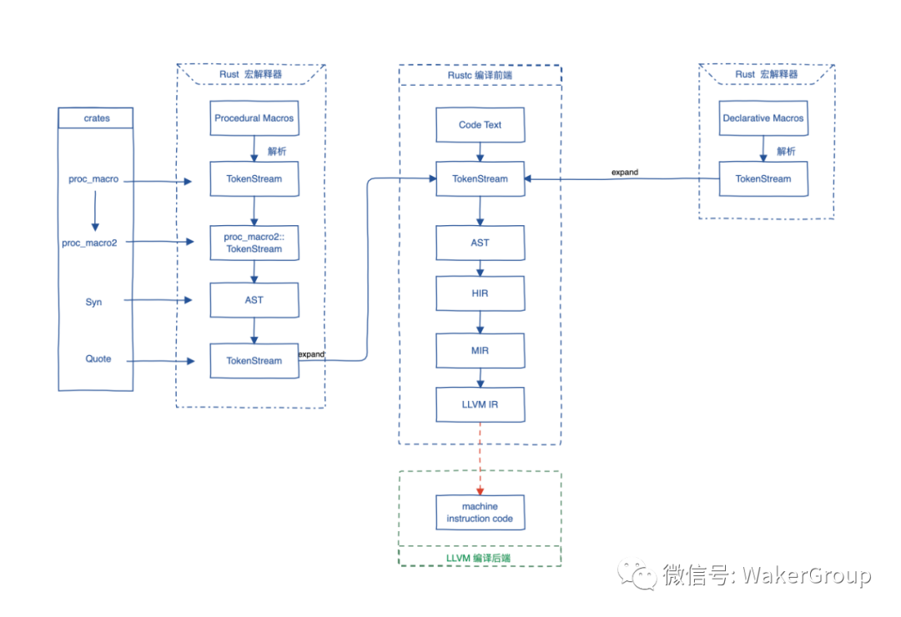

# Rust 笔记

## Rust 的 安装与卸载

[官方 -- 安装 Rust](https://www.rust-lang.org/zh-CN/tools/install)

    # 安装
    curl --proto '=https' --tlsv1.2 https://sh.rustup.rs -sSf | sh

    # 版本号
    rustc --version

    # 升级
    rustup update stable
    rustup update

    # 设置默认 版本
    rustup default stable
    rustup default nightly

    # 工具链
    rustup toolchain install nightly
    rustup toolchain install nightly-2020-11-19
    rustup toolchain list
    rustup default nightly-2020-11-19

    ps:
        "2020-11-19" 这个时间是在 rust 的 git 中的tag上找的

        rustup override set nightly

    # riscv
    rustup target add riscv32imac-unknown-none-elf

    # arm
    rustup target add thumbv7m-none-eabi

    # 卸载
    rustup self uninstall

    # 查看组件
    rustup component list

## 自动补全

    rustup completions bash rustup > ~/.rustup_completes

    添加到 .bashrc 中:
        source ~/.rustup_completes

    rustup completions bash cargo
    
    添加到 .bashrc 中:
        source $(rustc --print sysroot)/etc/bash_completion.d/cargo

## cargo 命令

    安装常用的工具:

        # 扩展cargo, 允许对 dependencies 的增删改
        # 查看依赖关系
        # 基于模板生成项目
        # 宏展开
        cargo install cargo-edit cargo-tree cargo-generate cargo-expand

        ps:
            cargo-edit 部分命令:
                cargo add <crate>
                cargo add <crate> --allow-prerelease, 允许使用beta版本的库
                cargo rm <crate>
                cargo upgrade

            cargo-tree 部分命令:
                cargo tree
                cargo tree -e features
                cargo tree -f "{p} {f}"

        # 文档生成, 及插件: 用于数学表达式, 生成流程图表
        cargo install mdbook mdbook-katex mdbook-mermaid

    # 创建项目
    cargo new hello_cargo

    # 编译 并生成可执行程序
    cd hello_cargo
    cargo build
    cargo build --release
    cargo build --target thumbv7m-none-eabi

    # 编译 但不生成 可执行程序
    cargo check

    # 运行目标程序 (也可以一步构建项目)
    cargo run

    # 创建
    cargo new hello_world <--bin>, 创建一个二进制程序
    cargo new hello_world --lib, 创建一个库

    # 参数

    不使用默认的features:
        --no-default-features

        指定features:
            --features="FEATURE1 FEATURE2 ..."

## vscode 中 rust 的插件

    1. rust-analyzer
    2. Crates
    3. Even Better TOML
    4. CodeLLDB

## rust 软件源

[参考自](https://huangjj27.gitlab.io/posts/rust-mirror/)

### 设置环境变量

    # 清华大学
    export RUSTUP_DIST_SERVER=https://mirrors.tuna.tsinghua.edu.cn/rustup

    # 中国科学技术大学
    export RUSTUP_DIST_SERVER=https://mirrors.ustc.edu.cn/rust-static
    export RUSTUP_UPDATE_ROOT=https://mirrors.ustc.edu.cn/rust-static/rustup

    # 上海交通大学
    export RUSTUP_DIST_SERVER=https://mirrors.sjtug.sjtu.edu.cn/rust-static/

### 加速 crate 拉取, $HOME/.cargo/config

    [source.crates-io]
    registry = "https://github.com/rust-lang/crates.io-index"

    # 替换成你偏好的镜像源
    replace-with = 'sjtu'
    #replace-with = 'ustc'

    # 清华大学
    [source.tuna]
    registry = "https://mirrors.tuna.tsinghua.edu.cn/git/crates.io-index.git"

    # 中国科学技术大学
    [source.ustc]
    registry = "git://mirrors.ustc.edu.cn/crates.io-index"

    # 上海交通大学
    [source.sjtu]
    registry = "https://mirrors.sjtug.sjtu.edu.cn/git/crates.io-index"

    # rustcc社区
    [source.rustcc]
    registry = "git://crates.rustcc.cn/crates.io-index"
## Rust 编译过程

Rust编译器(rustc)是一个编译器前端, 它负责把文本代码一步步编译到LLVM中间码(LLVM IR), 再交给LLVM, 最终生成机器码, 所以LLVM是编译器后端.

宏展开 --> 语法语义分析 --> 生成抽象语法树 --> LLVM IR (LLVM中间语言) --> 通过LLVM生成机器码

## Rust hello_world

    编写点一个程序:
        vim main.rs

        fn main() {
            println!("Hello, world!");
        }

    编译:
        rustc main.rs

    运行:
        ./main

## 库

    kurbo
        曲线工具

    lyon
        路径细分库, 可以用于基于GPU的2D图形渲染

    tokio
        https://github.com/tokio-rs/tokio

    embedded_graphics
        mcu gui

    embedded_sdmmc

### iced

    sudo apt install libssl-dev

    官方的例子:

        git clone https://github.com/hecrj/iced.git

        cd iced

        cargo build
        cargo build -vv 显示详细的编译命令

        // --features glow,glow_canvas
        cargo run --package todos

    // 如果无法运行, 缺少显示驱动
    sudo apt install libvulkan1 mesa-vulkan-drivers vulkan-utils

### iced: 编译 并 运行所有的 examples

    #!/bin/bash

    examples=(iced_core iced_futures iced_graphics iced_native iced_style iced_glow iced_glutin iced_winit iced_web iced_wgpu bezier_tool iced clock color_palette counter custom_widget download_progress events game_of_life geometry integration pane_grid pick_list pokedex progress_bar qr_code scrollable solar_system stopwatch styling svg todos tour)

    for example in \${examples[@]}; do
        cargo build --verbose --package $example
    done

    for example in \${examples[@]}; do
        echo "start run: cargo run --verbose --package $example"
        cargo run --verbose --package $example
    done

### iced 例子

    学习基本的布局:
        target/debug/pane_grid
        examples/tour

    学习canvas:
        examples/clock

## libusb, usb库

    在windows上找不到libusb库, 在 ~/.cargo/config 中添加:

    [target.x86_64-pc-windows-msvc.'usb-1.0']
    rustc-link-search = ['D:\libs\64bit']
    rustc-link-lib = ['libusb-1.0']

## wasm 开发

    安装 wasm-pack:

        curl https://rustwasm.github.io/wasm-pack/installer/init.sh -sSf | sh

    cargo install cargo-generate

    cargo generate --git https://github.com/rustwasm/wasm-pack-template -n wasm-app

    cd wasm-app
    wasm-pack build

    npm init wasm-app www

    cd www
    yarn

    cd ../pkg
    yarn link

    cd ../www
    yarn link "wasm-app"

## vue vite rust wasm

    yarn create @vitejs/app my-vue-app --template vue

    cd my-vue-app
    yarn add -D vite-plugin-rsw

    yarn

    cargo generate --git https://github.com/rustwasm/wasm-pack-template -n wasm-app

    vite.config.js:

        import { defineConfig } from "vite";
        import vue from "@vitejs/plugin-vue";
        import ViteRsw from 'vite-plugin-rsw';

        // https://vitejs.dev/config/
        export default defineConfig({
            plugins: [
                vue(),
                ViteRsw({
                    mode: "release",
                    crates: ["wasm-app"],
                }),
            ],
        });

## 异步

    impl Future for Server

    Server实例就可以直接使用 .await 了
