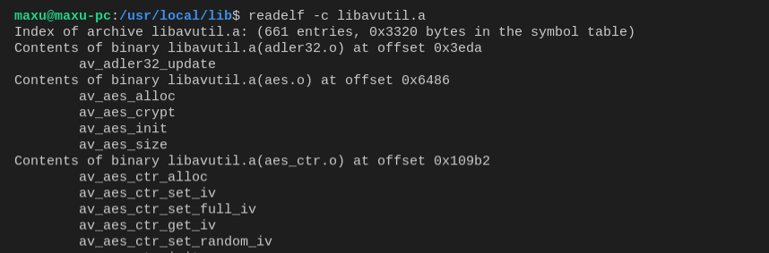
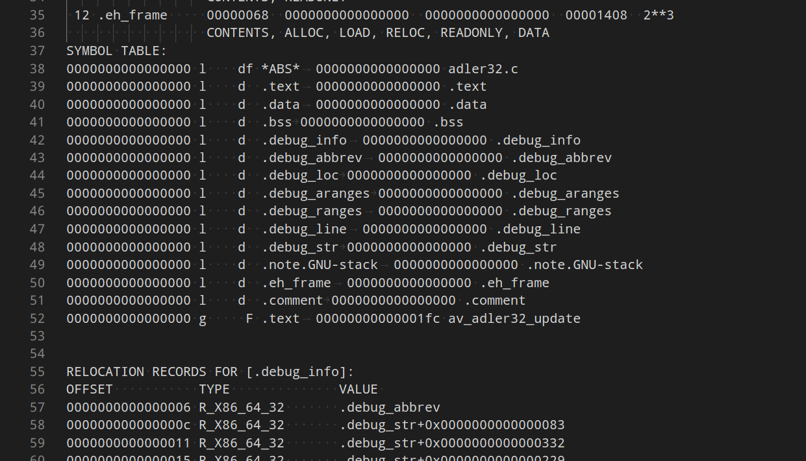

# linux 工具

## 查看静态库/动态库中有哪些函数

```readelf -c libavutil.a```
可以看到库中包含的.obj文件的段信息



```objdump -x libavutil.a```
也能看到.obj文件的段信息, 但是更加详细



## flameshot 截图工具

命令: flameshot gui, 进入截图

## DSView 逻辑分析器

### 编译

	git clone https://github.com/DreamSourceLab/DSView.git

	sudo apt-get install git-core build-essential cmake autoconf automake libtool pkg-config \
	libglib2.0-dev libzip-dev libudev-dev libusb-1.0-0-dev \
	python3-dev qt5-default libboost-dev libboost-test-dev libboost-thread-dev libboost-system-dev libboost-filesystem-dev check libfftw3-dev

	cd libsigrok4DSL
	./autogen.sh
	./configure
	make -j
	sudo make install
	cd ..

	cd libsigrokdecode4DSL
	./autogen.sh
	./configure
	make -j
	sudo make install
	cd ..

	cd DSView
	mkdir build -p && cd build && cmake ..
	make -j
	sudo make install


## wps 中文字体部分无显示

[添加字体， 更新字体缓存](https://mxy493.xyz/2019040840601/) 需要重启生效(或登出?)

## Samba 共享

安装

    sudo apt-get install samba

修改 /etc/samba/smb.cof

    [profiles]
    comment = Share Folder
    path = /develop/share
    guest ok = yes
    browseable = yes
    public = yes
    writable = yes
    force users = nobody
    force group = nogroup
    force create mode = 0775
    force directory mode = 0775

[linux访问windows的共享](https://segmentfault.com/a/1190000039363538)

## BT 下载工具 -- Tixati

使用Tixati, 在界面上, 点击Transfers, 点击 "Add", 打开URL, 输入 BT链接, 就会搜索资源, 点击 Start 开始下载

## python 版本管理工具 -- pyenv

    https://github.com/pyenv/pyenv

    安装：

        git clone https://github.com/pyenv/pyenv.git ~/.pyenv

        cd ~/.pyenv && src/configure && make -C src

        echo 'export PYENV_ROOT="$HOME/.pyenv"' >> ~/.bash_profile
        echo 'export PATH="$PYENV_ROOT/bin:$PATH"' >> ~/.bash_profile
        eval "$(pyenv init -)"

    用法：

        pyenv install -l

        pyenv install 3.9.6

        pyenv global 3.9.6
        pyenv local 3.9.6

        查看当前版本：
            pyenv version

        查看当前所有的版本：
            pyenv versions
        
        python --version
        pip --version

        pyenv local 3.9.6 当前目录下自动创建环境
