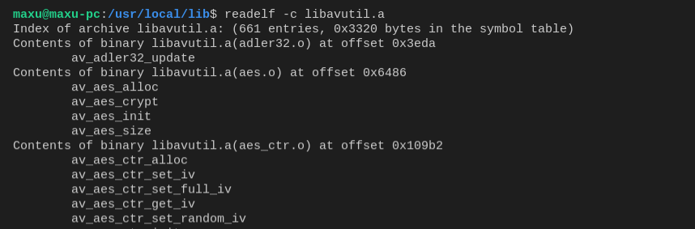
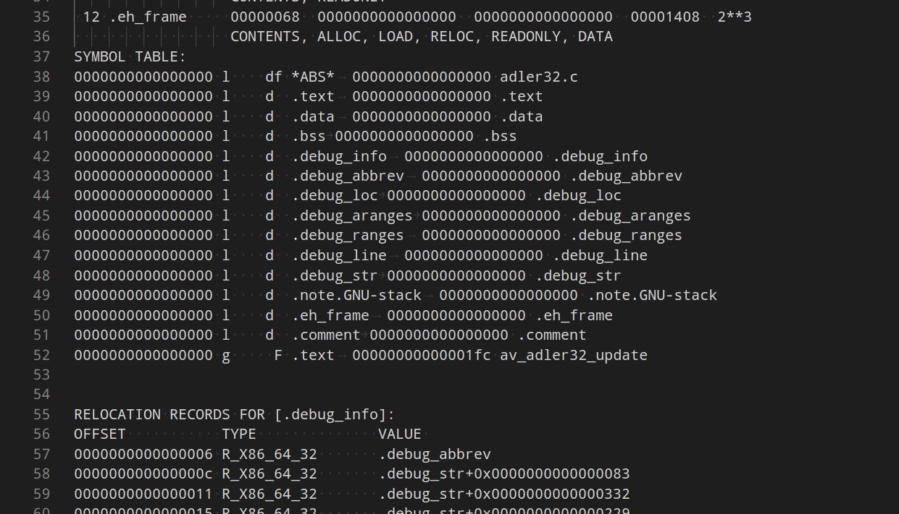

# Linux 工具

## 说明

- 本页整理 Linux 环境下常见的开发与系统工具使用记录.
- 当前覆盖二进制分析, 截图工具, 逻辑分析器, Samba 共享和历史下载工具等主题.
- 若只是查通用命令, 优先看 [Linux 常用命令](./linux常用命令.md).

## 二进制与库分析

### 查看静态库 / 动态库中的符号与段信息

```sh
readelf -c libavutil.a
objdump -x libavutil.a
```

- `readelf` 适合快速查看段信息.
- `objdump` 信息更详细, 适合进一步分析对象文件结构.





## 桌面工具

### `flameshot`

```sh
flameshot gui
```

- 用于交互式截图.
- 适合做界面标注, 错误记录和文档插图.

### WPS 中文字体部分无显示

- 这类问题通常和系统字体缺失有关.
- 可参考字体安装与字体缓存刷新流程: <https://mxy493.xyz/2019040840601/>
- 更新字体缓存后, 往往需要重启应用或重新登录桌面环境.

## 设备与调试工具

### DSView 逻辑分析器

编译流程记录:

```sh
git clone https://github.com/DreamSourceLab/DSView.git
sudo apt-get install git-core build-essential cmake autoconf automake libtool pkg-config   libglib2.0-dev libzip-dev libudev-dev libusb-1.0-0-dev   python3-dev qt5-default libboost-dev libboost-test-dev libboost-thread-dev   libboost-system-dev libboost-filesystem-dev check libfftw3-dev

cd libsigrok4DSL
./autogen.sh
./configure
make -j
sudo make install
cd ..

cd libsigrokdecode4DSL
./autogen.sh
./configure
make -j
sudo make install
cd ..

cd DSView
mkdir build -p && cd build && cmake ..
make -j
sudo make install
```

- 更适合做本地编译记录与环境追溯.
- 真正排错时, 还要结合 `libusb`, `udev` 和 Qt 依赖逐项检查.

## 文件共享

### Samba 共享

安装:

```sh
sudo apt-get install samba
```

示例配置:

```ini
[profiles]
comment = Share Folder
path = /develop/share
guest ok = yes
browseable = yes
public = yes
writable = yes
force users = nobody
force group = nogroup
force create mode = 0775
force directory mode = 0775
```

- 修改后记得检查配置文件路径与服务重启流程.
- Linux 访问 Windows 共享时, 还要结合挂载参数和权限处理一起排查.

参考: <https://segmentfault.com/a/1190000039363538>

## 历史工具记录

### BT 下载工具 `Tixati`

- 在界面里点击 `Transfers -> Add`, 打开 URL 后输入 BT 链接即可开始搜索与下载.
- 这类记录更偏历史工具备忘, 当前可作为补充说明保留.

### `pyenv`

```sh
git clone https://github.com/pyenv/pyenv.git ~/.pyenv
cd ~/.pyenv && src/configure && make -C src
```

- 更完整的 Python 环境管理建议回到 [Python 总览](../../program/python/README.md) 和 `pyenv` 相关页面继续整理.

## 使用建议

- 本页适合保留“工具入口 + 最小命令 + 排查线索”, 不适合承载超长安装教程.
- 某个工具已经形成稳定主题时, 建议单独升级为独立专题页.
- 与桌面环境强相关的工具问题, 也可以回到发行版页面继续记录上下文.

## 相关文档

- [Linux 总览](./README.md)
- [Linux 常用命令](./linux常用命令.md)
- [Linux 综合笔记](./Linux笔记.md)
