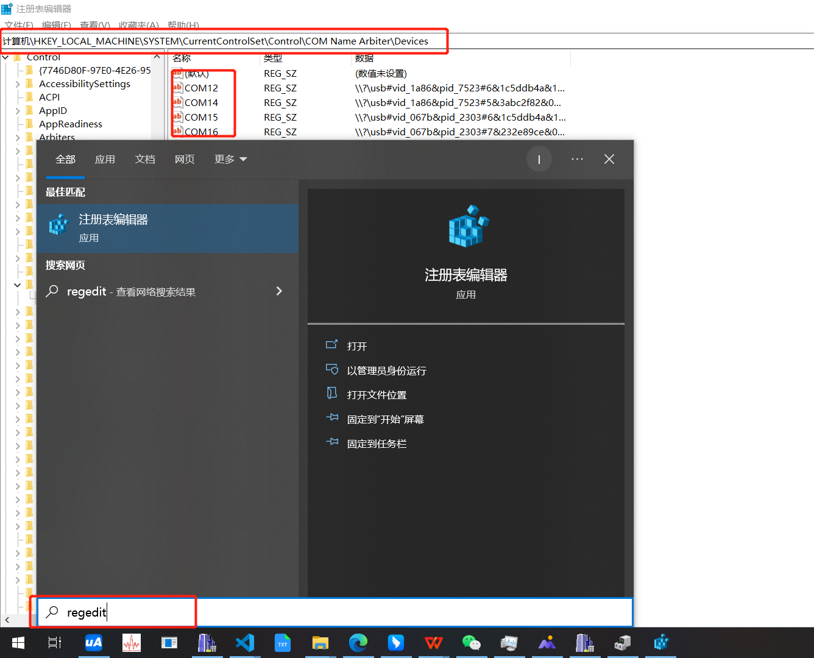

## 系统清理

AppData\Local\Yarn\Cache 6 个多 G
清理: yarn cache clean

AppData\Local\Temp 6 个 G
删除目录

AppData\Roaming\Tencent 2.02G
删除目录

```bat
@echo off
color 0a
echo ★☆ ★☆ ★☆ ★☆ ★☆★☆★☆ ★☆ ★☆ ★☆ ★☆★
echo ★☆ ★☆ ★☆ ★☆ ★☆★☆★☆ ★☆ ★☆ ★☆ ★☆★
echo.★☆ ☆★
echo.★☆ ☆★
echo.★☆ 小海清理系统垃圾文件，请稍等...... ☆★
echo ★☆ ☆★
echo.★☆  ☆★
echo ★☆ ★☆ ★☆ ★☆ ★☆★☆★☆ ★☆ ★☆ ★☆ ★☆★
echo ★☆ ★☆ ★☆ ★☆ ★☆★☆★☆ ★☆ ★☆ ★☆ ★☆★

echo 正在清除系统临时文件 *.tmp *._tmp *.log *.chk *.old ，请稍等...
del /f /s /q %systemdrive%\*.tmp
del /f /s /q %systemdrive%\*._mp
del /f /s /q %systemdrive%\*.log
del /f /s /q %systemdrive%\*.gid
del /f /s /q %systemdrive%\*.chk
del /f /s /q %systemdrive%\*.old

echo 清空垃圾箱，备份文件和预缓存脚本...
del /f /s /q %systemdrive%\recycled\*.*
del /f /s /q %windir%\*.bak
del /f /s /q %windir%\prefetch\*.*
rd /s /q %windir%\temp & md %windir%\temp

echo 删除补丁备份目录
RD %windir%\$hf_mig$ /Q /S

echo 把补丁卸载文件夹的名字保存成2950800.txt
dir %windir%\$NtUninstall* /a:d /b >%windir%\2950800.txt

echo 从2950800.txt中读取文件夹列表并且删除文件夹
for /f %%i in (%windir%\2950800.txt) do rd %windir%\%%i /s /q

echo 删除2950800.txt
del %windir%\2950800.txt /f /q

echo 删除补丁安装记录内容（下面的del /f /s /q %systemdrive%\*.log已经包含删除此类文件）
del %windir%\KB*.log /f /q

echo 清理系统盘无用文件...
%windir%\system32\sfc.exe /purgecache

echo 优化预读信息...
%windir%\system32\defrag.exe %systemdrive% -b

echo ★☆★☆★☆★☆★☆★☆★☆★☆★☆★☆★☆★☆★☆★☆★☆★☆★
echo ★☆★☆★☆★☆★☆★☆★☆★☆★☆★☆★☆★☆★☆★☆★☆★☆★
echo ★☆ ☆★
echo.★☆ ☆★
echo.★☆ ☆★
echo ★☆  ☆★
echo ★☆ 恭喜您！小海已为你清理系统垃圾！ ☆★
echo.★☆ ☆★
echo ★☆ ☆★
echo.★☆  ☆★
echo ★☆★☆★☆★☆★☆★☆★☆★☆★☆★☆★☆★☆★☆★☆★☆★☆★
echo ★☆★☆★☆★☆★☆★☆★☆★☆★☆★☆★☆★☆★☆★☆★☆★☆★

echo. & pause
```

## 中控机报错: 应用程序无法正常启动 0xc000007b

[参考: How To Fix Error 0xc000007b in Windows 10](https://www.youtube.com/watch?v=kzYbDPxdMbo)

http://www.mediafire.com/file/97erhoox4d3zabq/aio210.zip/file

### 查看可执行程序依赖库

http://dependencywalker.com/

###

https://docs.microsoft.com/en-us/sysinternals/downloads/procmon

上面的办法都没什么用, 我遇到的问题, 64 位 dll 与 32 位 dll

## 环境变量

### cmd

设置临时环境变量

    set A=a/b/c
    set A=a/b/c;%A%

### PowerShell

查看 环境变量列表

    ls env:

    $env:PATH

设置临时环境变量

    $env:A="a/b/c"
    $env:A="a/b/c;$env:A"

## 清除端口

打开 regedit
输入: 计算机\HKEY_LOCAL_MACHINE\SYSTEM\CurrentControlSet\Control\COM Name Arbiter\Devices
删除 你不想要的所有用过的 COM 端口



## 删除 virtual box 网卡

启用需要删除的 virtual box 网卡, 在 virtual box 的虚拟网卡中(不启用的话, 这个列表中看不到), 删除
